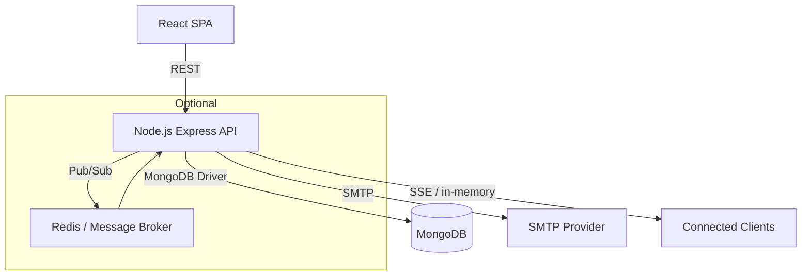
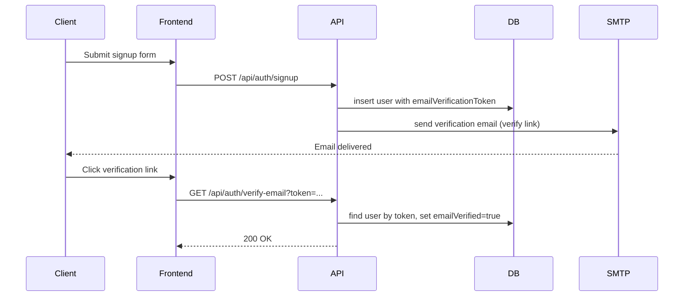
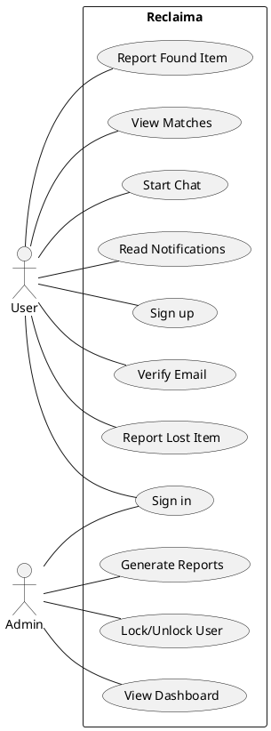
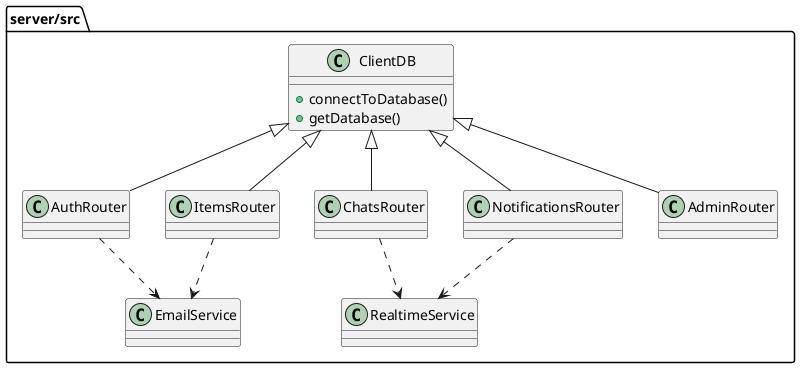

# Reclaima — Software Design Document (SDD)

Last updated: 2026-04-28

This document describes the design of the Reclaima application (frontend + Node.js backend + MongoDB). It is based on the actual source code in this repository and contains implementation-level details, database models, API documentation, security and deployment guidance, plus runnable diagrams (Mermaid / PlantUML / DBML).

**Contents**

- **1. Introduction**
- **2. System Overview**
- **3. Functional Requirements**
- **4. Non-Functional Requirements**
- **5. System Architecture**
- **6. MongoDB Database Design (DBML + explanation)**
- **7. API Reference**
- **8. Security Design**
- **9. Deployment & Operations**
- **Appendix: Diagrams**

---

**1. Introduction**

Purpose

- Reclaima is a lost-and-found platform to report lost/found items, discover smart matches, message reporters, and manage user accounts. The backend is a Node.js API using the native `mongodb` driver. The frontend is a React single-page application.

Scope

- This SDD covers the codebase in this repository: backend REST API (server/src), frontend React SPA (src), email and realtime services, and admin/reporting features.

Objectives

- Provide a complete technical reference for developers and operators: architecture, data model, APIs, security, and deployment recommendations.

Intended users

- Developers, maintainers, DevOps engineers, and technical reviewers.

Definitions & Acronyms

- API — Application Programming Interface (HTTP/REST)
- SPA — Single Page Application (React)
- DB — Database (MongoDB)
- TTL — Time To Live

---

**2. System Overview**

High-level overview

- Frontend: React SPA (Vite). Routing and protected routes live in `src/router/AppRouter.jsx`.
- Backend: Express.js app (`server/src/app.js`) exposing REST endpoints under `/api/*`.
- Database: MongoDB (native driver) accessed via `server/src/db/client.js`.
- Email: `nodemailer` via `server/src/services/email.js`.
- Realtime notifications: Server-Sent Events (SSE) via `server/src/services/realtime.js`.

Core modules

- `server/src/routes/*` — route handlers: `auth`, `items`, `chats`, `notifications`, `admin`, `health`.
- `server/src/services/email.js` — all transactional emails (verification, password reset, match notifications, admin emails).
- `server/src/services/realtime.js` — SSE client registry and push helper `sendToUser`.
- `server/src/db/client.js` — MongoDB client lifecycle utilities.

User roles

- `user` — standard user who can report lost/found items, message, and manage profile.
- `admin` — elevated role for moderation, reporting, user management and generating CSV/PDF reports. Admin routes require role check in `admin.routes.js`.

Main workflows

- Signup → email verification → sign in → create lost/found report → system sends match emails and stores match notifications.
- Messaging: start chat by item, send messages; backend persists chats and messages and emits SSE notifications.
- Admin flows: view overview, list users, lock/unlock accounts, generate reports.

---

**3. Functional Requirements**

Features (mapped to implementation)

- User registration (`POST /api/auth/signup`) with email verification token and password hashing (scrypt).
- Sign-in (`POST /api/auth/signin`) issues a random `authToken` stored in `users.authToken`.
- Retrieve/Update profile (`GET/PATCH /api/auth/me`).
- Password reset flow (`/request-password-reset`, `/reset-password`).
- Post lost/found items (`POST /api/items/lost`, `/found`) with index-supported search and summary endpoints.
- Smart-matching heuristics inside `items.routes.js` (token overlap, category & zone/location comparisons). Match notifications are recorded in `match_notifications` collection and emailed.
- Chats & messages endpoints with SSE push notifications via `notifications` collection and `services/realtime.js`.
- Notifications listing and streaming (`GET /api/notifications`, `/stream`).
- Admin-only endpoints for reports and user moderation under `/api/admin/*`.

User interactions

- Web UI uses `useAuthUser` (localStorage) to guard routes. Protected routes redirect to sign-in or verification based on `emailVerified` and `accountLocked`.

Business rules

- Email verification TTL: 24 hours (EMAIL_VERIFICATION_TTL_MS).
- Password reset TTL: 1 hour (PASSWORD_RESET_TTL_MS).
- Match notification TTL: configured to expire documents after 30 days (expireAfterSeconds index).
- Unique constraints and indexes: email unique index in `users`, `match_notifications` unique on (lostItemId, foundItemId).

---

**4. Non-Functional Requirements**

Performance

- Backend: stateless HTTP API; MongoDB indexes applied in code ensure efficient lookups for common queries (createdAt, type, status, participants, itemId).

Scalability

- Scale horizontally by running multiple backend instances behind a load balancer. Use a shared MongoDB cluster (Atlas) and external email service for scaling email delivery.
- SSE connections are in-memory per backend process (Map of clients); for multi-instance deployments use a central pub/sub (Redis, message broker) to broadcast events between processes.

Security

- Passwords are hashed with scrypt (salted) and stored as `salt:derivedHex` in `users.passwordHash`.
- Authentication uses opaque bearer tokens stored in DB in `users.authToken` — these are random 48-hex characters.
- Admin endpoints protect via role check and bearer token.

Reliability & Availability

- Graceful shutdown implemented in `server/src/index.js` to close DB connections.
- Health endpoint (`/api/health`) reports DB connection status.

Maintainability

- Routes are modularized per domain. Email templates and PDF/report generation are encapsulated in `services/email.js` and `admin.routes.js` respectively.

---

**5. System Architecture**

Frontend architecture

- React + Vite SPA. Routing uses React Router with `ProtectedRoute`, `PublicRoute`, `AdminRoute` wrappers.
- Local authentication state persisted in `localStorage` under key `authUser`.

Backend architecture

- Express.js app exposing REST endpoints.
- MongoDB native driver client with manual index creation in route helpers.
- Email abstractions using `nodemailer` with SMTP credentials from environment.

Database architecture

- Collections: `users`, `items`, `chats`, `messages`, `notifications`, `match_notifications` and `match_notifications` TTL index.

API communication flow

- Frontend calls REST endpoints at `/api/*` and consumes SSE at `/api/notifications/stream`.
- Backend sends emails asynchronously and records notification documents.

External integrations

- SMTP for emails (configured via env vars: `SMTP_HOST`, `SMTP_PORT`, `SMTP_USER`, `SMTP_PASS`).

---

**6. MongoDB Database Design**

Collections (inferred from code) and key fields:

- users
  - \_id ObjectId [pk]
  - firstName string
  - lastName string
  - email string (unique)
  - passwordHash string (salt:derivedHex)
  - role string (user|admin)
  - emailVerified boolean
  - emailVerificationToken string
  - emailVerificationTokenIssuedAt datetime
  - passwordResetToken string
  - passwordResetTokenIssuedAt datetime
  - authToken string
  - authTokenIssuedAt datetime
  - accountLocked boolean
  - accountLockReason string
  - accountLockedAt datetime
  - accountLockedBy string
  - avatarUrl string
  - phone, campus, language, studentId, bio
  - createdAt, updatedAt

- items
  - \_id ObjectId [pk]
  - type string (lost|found)
  - title, category, description, location, zone
  - contactName, contactEmail, contactPhone
  - handoverMethod, photoUrl
  - status string (open|returned|resolved...)
  - returnedAt, returnedBy, returnMethod, returnedNote
  - createdAt, updatedAt

- match_notifications
  - \_id ObjectId [pk]
  - lostItemId string
  - foundItemId string
  - sentAt datetime (expireAfterSeconds index applied to support TTL)

- chats
  - \_id ObjectId
  - itemId ObjectId | string
  - participants [ObjectId]
  - createdAt, updatedAt, lastMessageAt

- messages
  - \_id ObjectId
  - chatId ObjectId
  - senderId ObjectId
  - recipientId ObjectId
  - text string
  - readAt datetime | null
  - createdAt

- notifications
  - \_id ObjectId
  - userId ObjectId
  - type string (message|match|system)
  - chatId, messageId, itemId
  - text, createdAt, readAt

Indexing considerations (already applied in code)

- `users.createIndex({ email: 1 }, { unique: true })`
- `items` indexes: `{createdAt:-1}`, `{type:1, createdAt:-1}`, `{status:1, createdAt:-1}`, `{type:1, contactEmail:1, createdAt:-1}`, `{type:1, category:1, createdAt:-1}`
- `match_notifications` unique `{lostItemId:1, foundItemId:1}` and TTL index on `sentAt`.
- `chats` & `messages` indexes: `chats.createIndex({ itemId: 1, participants: 1 })`, `chats.createIndex({ participants: 1, lastMessageAt: -1 })`, `messages.createIndex({ chatId: 1, createdAt: -1 })`

DBML representation (compatible with https://dbdiagram.io)

```dbml
Table users {
  _id ObjectId [pk]
  firstName string
  lastName string
  email string [unique]
  passwordHash string
  role string
  emailVerified boolean
  emailVerificationToken string
  emailVerificationTokenIssuedAt datetime
  passwordResetToken string
  passwordResetTokenIssuedAt datetime
  authToken string
  authTokenIssuedAt datetime
  accountLocked boolean
  accountLockReason text
  accountLockedAt datetime
  accountLockedBy string
  avatarUrl string
  phone string
  campus string
  language string
  studentId string
  bio text
  createdAt datetime
  updatedAt datetime
}

Table items {
  _id ObjectId [pk]
  type string
  title string
  category string
  description text
  location string
  zone string
  contactName string
  contactEmail string
  contactPhone string
  handoverMethod string
  photoUrl string
  status string
  returnedAt datetime
  returnedBy string
  returnMethod string
  returnedNote text
  createdAt datetime
  updatedAt datetime
}

Table match_notifications {
  _id ObjectId [pk]
  lostItemId string
  foundItemId string
  sentAt datetime
}

Table chats {
  _id ObjectId [pk]
  itemId ObjectId
  participants text
  createdAt datetime
  updatedAt datetime
  lastMessageAt datetime
}

Table messages {
  _id ObjectId [pk]
  chatId ObjectId
  senderId ObjectId
  recipientId ObjectId
  text text
  readAt datetime
  createdAt datetime
}

Table notifications {
  _id ObjectId [pk]
  userId ObjectId
  type string
  chatId ObjectId
  messageId ObjectId
  itemId ObjectId
  text text
  createdAt datetime
  readAt datetime
}
```

Notes:

- Many fields are optional and may be stored as empty strings; the code defensively handles missing fields.

---

**7. API Reference (extracted from server/src/routes)**

Authentication: general

- All protected endpoints expect `Authorization: Bearer <token>` header where the token is `users.authToken` assigned at signin.

Auth endpoints (`/api/auth`)

- POST /api/auth/signup
  - Body: { firstName, lastName, email, password }
  - Responses: 201 created + requiresEmailVerification true, 400 validation errors, 409 email exists
- POST /api/auth/signin
  - Body: { email, password }
  - Responses: 200 { token, user }, 401 invalid credentials, 403 email not verified
- GET /api/auth/verify-email?token=...
  - Query: token
  - Responses: 200 verified, 404 invalid token, 410 expired
- POST /api/auth/resend-verification
  - Body: { email }
- GET /api/auth/me
  - Auth required. Returns user profile.
- PATCH /api/auth/me
  - Auth required. Body: profile fields to update. Validation enforced.
- PATCH /api/auth/change-password
  - Auth required. Body: { currentPassword, newPassword, confirmPassword }
- POST /api/auth/request-account-deletion
  - Auth required. Body: { reason }
- POST /api/auth/request-password-reset
  - Body: { email } (returns 200 even if account doesn't exist)
- POST /api/auth/reset-password
  - Body: { token, password, confirmPassword }

Items (`/api/items`)

- GET /api/items?type=lost|found
  - Returns list of items; supports `type` filter.
- GET /api/items/matches?email=...
  - Returns matched found items for a user's lost reports (email-based).
- GET /api/items/summary?email=...
  - Returns counts and recent items for a user.
- GET /api/items/:id
  - Returns item by id.
- PATCH /api/items/:id/status
  - Body: { status, returnMethod, returnedBy, returnedNote } — updates status; when `returned` additional fields set.
- POST /api/items/lost
  - Body: allowed fields listed in ALLOWED_ITEM_FIELDS. Creates a lost report.
- POST /api/items/found
  - Body: allowed fields. Creates a found report and triggers `notifyLostItemMatches` which may send match emails and insert into `match_notifications`.

Chats (`/api/chats`)

- POST /api/chats/by-item
  - Body: { itemId, senderId } — starts or returns chat for reporter and sender.
- GET /api/chats?userId=...
  - Returns list of chats for a user with lastMessage.
- GET /api/chats/:id?userId=...
  - Returns chat detail and recipient info (if userId provided).
- GET /api/chats/:id/messages
  - Returns messages in chat (limited to 200).
- POST /api/chats/:id/messages
  - Body: { senderId, text } — create message, updates `chats` lastMessageAt, create notification doc, and push SSE via `sendToUser`.

Notifications (`/api/notifications`)

- GET /api/notifications?userId=...&unread=true
  - Returns notifications (optionally only unread) limited to 100.
- GET /api/notifications/stream?userId=...
  - SSE stream for the given user id. Backend keeps a Map of userId -> Set(responses). Keepalive `ping` events every 25s.
- POST /api/notifications/:id/read
  - Marks notification as read.

Admin (`/api/admin` — requires admin bearer token)

- GET /api/admin/overview
  - Returns aggregated totals and recent items.
- GET /api/admin/reports/items?type=&days=
  - CSV response (or PDF for users report) of items in range.
- GET /api/admin/reports/users?days=&format=csv|pdf
  - Returns user reports.
- GET /api/admin/users?query=&limit=
  - List users for admin.
- PATCH /api/admin/users/:id/role
  - Body: { role } — admin|user
- PATCH /api/admin/users/:id/lock
  - Body: { locked, reason } — lock or unlock account; sends account status email.

Health

- GET /api/health — returns service and DB status.

Error handling

- Routes return proper HTTP status codes with `{ message, errors? }` payloads. Server logs errors to console.

---

**8. Security Design**

Authentication flow (server-driven tokens)

- Signin uses `createToken()` which generates 24 random bytes hex (48 hex chars). That token is stored in `users.authToken` and returned to client. Subsequent requests include `Authorization: Bearer <token>`. The server looks up the user by `authToken` for authentication.

Password protection

- Passwords are hashed using Node's `crypto.scrypt` with a per-password random salt (16 bytes hex) and stored as `salt:derivedHex`. Verification uses `crypto.timingSafeEqual` to avoid timing attacks.

Authorization

- Role-based check in `admin.routes.js` ensures admin-only operations.

API security

- No CSRF protection necessary for token-based APIs consumed by SPA; ensure tokens are stored securely in client (currently stored in localStorage via `authUser` — see risks below).

Database security

- Use least privilege DB user and TLS for MongoDB connections. Use network allowlists for hosted DB and strong credentials (or IAM when using cloud providers).

Environment variables

- `MONGODB_URI`, `MONGODB_DB_NAME`, `SMTP_*`, `APP_BASE_URL`, and other secrets are read from environment via `dotenv` in `server/src/config/env.js`.

Security considerations & recommendations

- Current token strategy uses opaque tokens stored in DB. Consider switching to expiring JWTs or adding server-side expiry for `authToken` to allow session expiration and revocation.
- Storing `authUser` object and tokens in `localStorage` exposes them to XSS. Recommend storing tokens in `httpOnly` cookies or implementing stricter XSS hygiene (CSP, input sanitization) and rotating tokens.
- For multi-instance SSE support, replace in-memory SSE registry with Redis or message broker to broadcast notifications between instances.

---

**9. Deployment & Operations**

Development

- Start frontend: `npm run dev:frontend` (Vite), backend: `npm run dev:backend` (nodemon). `npm run dev` runs both via `concurrently`.
- Environment: copy `.env` from README (not included here) and set local MongoDB URI or Atlas connection.

Production deployment

- Recommended architecture:
  - Serve built React SPA from CDN or object storage + static hosting (Vercel, Netlify, S3+CloudFront) or serve via a static web server.
  - Deploy backend as Docker containers or Node processes behind a load balancer (e.g., AWS ECS/EKS, DigitalOcean App Platform, Heroku). Ensure `MONGODB_URI` points to a managed cluster.
  - Use SMTP provider credentials in env vars for `nodemailer` or prefer a transactional email provider (SendGrid, Mailgun) with API-based delivery.

MongoDB deployment considerations

- Use a replica set or managed cluster (Atlas) for production with automated backups and monitoring. Use TLS and IP access lists.
- Ensure `match_notifications` TTL index is configured by the app as shown in `items.routes.js`.

Scalability recommendations

- SSE: use a pub/sub layer (Redis pub/sub) to deliver events to all backend instances; keep only connection state minimal in each instance.
- Use horizontal scaling for stateless API and centralize session/token state in DB or Redis.

Monitoring & logging

- Add structured logging (winston/pino) and centralized logs (LogDNA/Datadog). Add health checks and process supervision.

Backups

- Daily backups of MongoDB and point-in-time restore for critical collections such as `users` and `items`.

---

Appendix: Diagrams (runnable)

**System Architecture (Mermaid)**
Explanation:
This diagram shows frontend, backend API, MongoDB, SMTP service, and optional Redis for SSE pub/sub described in recommendations.

Mermaid Code:



**User Signup Sequence (Mermaid sequence diagram)**
Explanation:
Shows signup flow, email verification token issuance and verification.

Mermaid Code:



**Match Notification Flow (Mermaid)**
Explanation:
When a found item is created, the backend searches lost items by category and location/zone, compares tokens and may send match emails and insert `match_notifications` to prevent duplicates.

Mermaid Code:

```mermaid
flowchart TD
  A[POST /api/items/found] --> B[Insert found item]
  B --> C[Query lost items by category]
  C --> D{isMatch(lost, found)?}
  D -- yes --> E[Check cooldown & match_notifications]
  E -- send --> F[sendMatchEmail] --> G[insert match_notifications]
  E -- no --> H[skip]
```

**Use Case Diagram (PlantUML)**
Explanation:
High-level actors and use cases: User and Admin with primary operations.

PlantUML Code:



**Class / Component Diagram (PlantUML)**
Explanation:
Simplified mapping of server modules and major collections.

PlantUML Code:



---